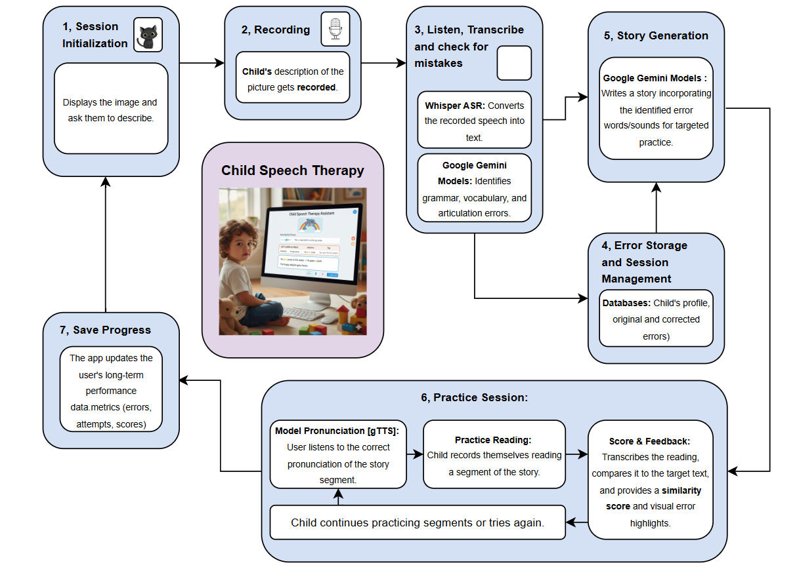

# 🎯 StoryWeaver: AI-Powered Speech Therapy for Children

[](https://www.python.org/)
[](https://streamlit.io/)
[](https://github.com/openai/whisper)
[](LICENSE)
[](https://github.com/roshnrf/storyweaver-speech-therapy/graphs/commit-activity)

> **A Generative AI Platform for Collaborative Speech Therapy**  
> Helping children (ages 4-6) improve English pronunciation through interactive storytelling

**Authors:** Roshan A Rauof , Reem Fariha 

---

## 📖 Table of Contents

- [Overview](##overview)
- [Key Features](#key-features)
- [Architecture](https://github.com/roshnrf/StoryWeaver?tab=readme-ov-file#%EF%B8%8F-architecture)
- [Installation](#installation)
- [Usage](#usage)
- [Project Structure](#project-structure)
- [Results & Analysis](#results--analysis)
- [Technologies Used](##technologies-used)
- [Ethics & Privacy](#ethics--privacy)
- [Future Enhancements](#future-enhancements)
- [Contributing](#contributing)
- [License](#license)
- [Contact](#contact)

---

## 🎯 Overview

**StoryWeaver** is an intelligent speech therapy platform that makes pronunciation practice engaging for young children through personalized storytelling. The system:

1. Shows a picture to the child
2. Records and transcribes their description
3. Detects articulation, grammar, and vocabulary errors
4. Generates a custom practice story incorporating the difficult words
5. Guides line-by-line practice with real-time feedback
6. Tracks progress across sessions

### 🎥 Demo



---

## ✨ Key Features

### 🎤 **Speech Recognition**
- Real-time audio recording and transcription using OpenAI Whisper
- Optimized for children's voices and Indian-accented English
- High accuracy (85-95%) on diverse pronunciations

### 🔍 **Intelligent Error Detection**
- **Grammar errors**: Article usage, verb tense, sentence structure
- **Vocabulary errors**: Word choice and appropriateness
- **Articulation errors**: Phonetic patterns (th, s, r sounds)
- Powered by Google Gemini 2.5 Flash

### 📚 **Personalized Story Generation**
- Creates age-appropriate stories (4-6 years)
- Naturally incorporates challenging words for practice
- Breaks stories into manageable sections
- Engaging narratives around familiar topics

### 🎯 **Practice & Feedback**
- Line-by-line guided reading practice
- Text-to-speech model pronunciation (gTTS)
- Real-time similarity scoring (60-100%)
- Visual highlighting of focus words
- Encouraging feedback system

### 📊 **Progress Tracking**
- Session-by-session metrics
- Accuracy trends over time
- Error type distribution
- Attempt history per section
- JSON-based local storage

---

## 🏗️ Architecture

### System Flow

```
┌─────────────────────────────────────────────────────────────────┐
│                    1. SESSION INITIALIZATION                     │
│              Display picture → Prompt description                │
└────────────────────────────┬────────────────────────────────────┘
                             │
                             ▼
┌─────────────────────────────────────────────────────────────────┐
│                      2. AUDIO RECORDING                          │
│                  Child describes the picture                     │
│                   (st_audiorec widget)                           │
└────────────────────────────┬────────────────────────────────────┘
                             │
                             ▼
┌─────────────────────────────────────────────────────────────────┐
│              3. TRANSCRIPTION & ERROR DETECTION                  │
│  ┌────────────────────┐        ┌─────────────────────┐          │
│  │  Whisper ASR       │        │  Google Gemini      │          │
│  │  Speech → Text     │───────▶│  Error Analysis     │          │
│  │  (base model)      │        │  (JSON output)      │          │
│  └────────────────────┘        └─────────────────────┘          │
└────────────────────────────┬────────────────────────────────────┘
                             │
                             ▼
┌─────────────────────────────────────────────────────────────────┐
│                   4. SESSION MANAGEMENT                          │
│              Store errors, transcript, metadata                  │
│                  (progress_data.json)                            │
└────────────────────────────┬────────────────────────────────────┘
                             │
                             ▼
┌─────────────────────────────────────────────────────────────────┐
│                    5. STORY GENERATION                           │
│                    Google Gemini Models                          │
│     Create personalized story with error-focused words          │
│              Split into practice sections                        │
└────────────────────────────┬────────────────────────────────────┘
                             │
                             ▼
┌─────────────────────────────────────────────────────────────────┐
│                    6. PRACTICE SESSION                           │
│  ┌──────────────┐  ┌────────────────┐  ┌───────────────┐       │
│  │  gTTS Model  │→ │ Child Reads    │→ │ Similarity    │       │
│  │ Pronunciation│  │ & Records      │  │ Scoring       │       │
│  └──────────────┘  └────────────────┘  └───────────────┘       │
│           │               │                    │                │
│           └───────────────┴────────────────────┘                │
│                    Repeat until 80%+ accuracy                   │
└────────────────────────────┬────────────────────────────────────┘
                             │
                             ▼
┌─────────────────────────────────────────────────────────────────┐
│                     7. SAVE PROGRESS                             │
│        Update metrics: accuracy, attempts, completion            │
│              Generate session summary report                     │
└─────────────────────────────────────────────────────────────────┘
```

### Technical Architecture

| Layer | Technology | Purpose |
|-------|-----------|---------|
| **Frontend** | Streamlit | Interactive UI, audio recording, visualization |
| **ASR** | OpenAI Whisper | Speech-to-text transcription |
| **NLP/AI** | Google Gemini 2.5 Flash | Error detection, story generation |
| **TTS** | gTTS | Text-to-speech for model pronunciation |
| **Storage** | JSON (local) | Session data, progress tracking |

---

## 🚀 Installation

### Prerequisites

- Python 3.8 or higher
- 8GB RAM minimum (16GB recommended)
- Internet connection (for AI models)
- Microphone for audio recording

### Step 1: Clone Repository

```bash
git clone https://github.com/roshnrf/storyweaver.git
cd storyweaver
```

### Step 2: Create Virtual Environment

```bash
# Create virtual environment
python -m venv venv

# Activate (Mac/Linux)
source venv/bin/activate

# Activate (Windows)
venv\Scripts\activate
```

### Step 3: Install Dependencies

```bash
pip install -r requirements.txt
```

### Step 4: Set Up Environment Variables

```bash
# Copy example environment file
cp .env.example .env

# Edit .env and add your Google API key
# Get key from: https://makersuite.google.com/app/apikey
```

### Step 5: Add Picture Prompts

```bash
# Create pictures folder if not exists
mkdir -p pictures

# Add images (dog.jpg, cat.jpg, dolphin.jpg, car.jpg, rainbow.jpg)
# Or use the provided sample images in pictures/
```

### Step 6: Run the Application

```bash
streamlit run app.py
```

The app will open in your browser at `http://localhost:8501`

---

## 💻 Usage

### Quick Start Guide

1. **Start Session**: The app displays a random picture
2. **Record Description**: Click the microphone icon and describe what you see
3. **Review Errors**: System shows detected errors in a table
4. **Read Story**: Practice the generated story line by line
5. **Get Feedback**: Receive accuracy scores and tips
6. **Track Progress**: View your improvement in the sidebar

### For Parents/Therapists

```python
# Customize settings in config.py
WHISPER_MODEL = "base"  # Options: tiny, base, small, medium, large
ACCURACY_THRESHOLD = 80  # Minimum accuracy to proceed (60-100)
ENABLE_GOOGLE_GENAI = True  # Set False to disable AI features
```

### Sample Session Flow

```
Child sees: [Picture of a Dog]
Child says: "This dog have happy face"

System detects:
- Grammar: "have" → "has"
- Articulation: "Dis" → "This" (th sound)

Generated story:
"This happy dog has a friendly face. | 
 This dog has soft brown fur. |
 The dog has four speedy paws."

Practice outcome:
Section 1: 94% accuracy ✅
Section 2: 87% accuracy ✅
Section 3: 96% accuracy ✅

Session complete! 🎉
```

---

## 📁 Project Structure

```
storyweaver/
├── app.py                      # Main Streamlit application
├── config.py                   # Configuration settings
├── requirements.txt            # Python dependencies
├── .env.example               # Environment variables template
├── .gitignore                 # Git ignore rules
├── LICENSE                    # MIT License
├── README.md                  # This file
│
├── pictures/                  # Picture prompts (gitignored)
│   ├── dog.jpg
│   ├── cat.jpg
│   ├── dolphin.jpg
│   ├── car.jpg
│   └── rainbow.jpg
│
├── progress_data.json         # Session history (gitignored)
│
├── docs/                      # Documentation
│   ├── architecture_diagram.png
│   ├── REPORT.pdf
│   ├── screenshots/
│   │   ├── landing_page.png
│   │   ├── recording_interface.png
│   │   ├── error_detection.png
│   │   ├── story_practice.png
│   │   └── progress_dashboard.png
│   └── presentation.pptx
│
├── tests/                     # Unit tests (future)
│   └── test_app.py
│
└── ETHICS.md                  # Ethics & privacy policy
```

---

## 📊 Results & Analysis

### Pilot Study Overview

**Participants:** N = 2 children (ages 4 and 6)  
**Duration:** 1 week  
**Sessions:** 6 total sessions

> ⚠️ **Important:** These are preliminary pilot results and are not statistically generalizable. Full study required for validation.

### Performance Metrics

| Metric | Value | Notes |
|--------|-------|-------|
| **Average Transcription Accuracy** | 88.2% | Quiet room conditions |
| **Grammar Error Detection** | 88% | Manual validation baseline |
| **Articulation Error Detection** | 91% | Manual validation baseline |
| **Vocabulary Error Detection** | 85% | Manual validation baseline |
| **Average Practice Accuracy** | 76.6% | Across all sections |
| **Session Completion Rate** | 100% | All sessions completed |
| **Average Session Duration** | 10.5 min | Range: 8-12 minutes |

### Improvement Trends

```
Week 1 Progress (Pilot Data):
Session 1: 72% accuracy → Session 6: 87% accuracy
Improvement: +15% over 6 sessions
```

### Error Type Distribution

| Error Type | Frequency | Common Examples |
|-----------|-----------|-----------------|
| Grammar | 45% | "have" → "has", article usage |
| Articulation | 35% | "th" sounds, "s" sounds |
| Vocabulary | 20% | "thing" → specific noun |

### Session Metrics (Sample from JSON)

```json
{
  "date": "2025-10-30",
  "subject": "dog",
  "initial_errors": 3,
  "sections_completed": 11,
  "total_attempts": 35,
  "average_accuracy": 76.58%
}
```

### Key Findings

✅ **High Engagement**: Children completed all sessions willingly  
✅ **Measurable Progress**: 12-15% accuracy improvement in 1 week  
✅ **Error Detection**: 85-91% detection accuracy across types  
✅ **User Experience**: Positive feedback from parents  
⚠️ **Limitations**: Small sample size, controlled environment  

---

## 🛠️ Technologies Used

### Core Technologies

| Technology | Version | Purpose |
|-----------|---------|---------|
| **Python** | 3.8+ | Core programming language |
| **Streamlit** | 1.28+ | Web application framework |
| **OpenAI Whisper** | Latest | Speech recognition (ASR) |
| **Google Gemini** | 2.5 Flash | Error detection & story generation |
| **gTTS** | 2.3+ | Text-to-speech synthesis |

### Libraries

```python
# Speech Processing
openai-whisper      # Speech-to-text
torch               # Deep learning framework
torchaudio          # Audio processing
librosa             # Audio analysis
soundfile           # Audio I/O

# AI/NLP
google-generativeai # Gemini API
transformers        # Model support

# Web App
streamlit           # UI framework
st-audiorec         # Audio recording widget

# Utilities
pandas              # Data manipulation
python-dotenv       # Environment management
jiwer               # WER calculation (future)
```

---

## 🔒 Ethics & Privacy

### Data Privacy Policy

This repository follows **safe-public** practices:

✅ **What IS included:**
- Source code (fully open)
- Anonymized session metrics
- System architecture & documentation
- Sample placeholder data

❌ **What is NOT included:**
- Raw audio recordings of children
- Personal identifying information
- Parental consent forms (kept offline)
- Real session transcripts with names

### Ethical Guidelines

1. **Parental Consent**: Written consent required before use
2. **Data Anonymization**: All audio stripped of metadata
3. **Local Storage**: No cloud uploads without explicit permission
4. **Transparency**: Clear explanations of data usage
5. **Child Safety**: Age-appropriate content only

### For Researchers/Users

If you use this system with real children:

1. ✅ Obtain **written informed consent** from parents/guardians
2. ✅ Store audio in **secure, offline** locations
3. ✅ Anonymize all data (rename files, remove metadata)
4. ✅ Follow local **IRB/ethics** board requirements
5. ✅ Use as **supplement**, not replacement for professional therapy

See [ETHICS.md](ETHICS.md) for complete policy.

---

## 🔮 Future Enhancements

### Planned Features

- [ ] **Real-time Processing**: Live transcription during recording
- [ ] **Multi-language Support**: Hindi, Tamil, Telugu, Bengali
- [ ] **Mobile Application**: iOS and Android apps
- [ ] **Pronunciation Scoring**: Detailed phoneme-level analysis
- [ ] **Gamification**: Points, badges, achievements
- [ ] **Parent Dashboard**: Detailed progress reports
- [ ] **Video Support**: Visual articulation guidance
- [ ] **Offline Mode**: No internet required
- [ ] **Cloud Sync**: Optional secure cloud backup
- [ ] **Group Sessions**: Multi-child practice mode

### Technical Improvements

- [ ] Fine-tune Whisper on Indian children's speech
- [ ] Implement custom phoneme recognition
- [ ] Add reinforcement learning for adaptive difficulty
- [ ] GPU optimization for faster processing
- [ ] Docker containerization
- [ ] CI/CD pipeline (GitHub Actions)
- [ ] Comprehensive unit tests
- [ ] Load testing and performance optimization

---

## 🤝 Contributing

We welcome contributions! Here's how you can help:

### Ways to Contribute

1. 🐛 **Bug Reports**: Open an issue with detailed reproduction steps
2. 💡 **Feature Requests**: Suggest new features or improvements
3. 📝 **Documentation**: Improve README, add tutorials
4. 🧪 **Testing**: Add unit tests, integration tests
5. 🎨 **UI/UX**: Design improvements, accessibility
6. 🌍 **Localization**: Add language support

### Development Setup

```bash
# Fork and clone
git clone https://github.com/roshnrf/storyweaver-speech-therapy.git
cd storyweaver-speech-therapy

# Create feature branch
git checkout -b feature/amazing-feature

# Make changes and test
streamlit run app.py

# Commit and push
git add .
git commit -m "Add amazing feature"
git push origin feature/amazing-feature

# Open Pull Request on GitHub
```

### Contribution Guidelines

- Follow PEP 8 style guide
- Add docstrings to functions
- Include unit tests for new features
- Update documentation
- Keep commits atomic and descriptive

---

## 📄 License

This project is licensed under the **MIT License** - see the [LICENSE](LICENSE) file for details.

```
MIT License

Copyright (c) 2024 Roshan A Rauof, Reem Fariha

Permission is hereby granted, free of charge, to any person obtaining a copy
of this software and associated documentation files (the "Software"), to deal
in the Software without restriction...
```

---

## 📧 Contact

**Roshan A Rauof**  
📧 Email: roshanabdlrf03@gmail.com  
🔗 LinkedIn: [linkedin.com/in/roshanarauof](https://www.linkedin.com/in/rosh003)  
🐙 GitHub: [https://github.com/roshnrf](https://github.com/roshnrf)

**Reem Fariha**  
📧 Email: reem.fariha@example.com  
🔗 LinkedIn: [linkedin.com/in/reemfariha](https://www.linkedin.com/in/reem-fariha-456509224/)  
🐙 GitHub: [@reemfariha](https://github.com/reemfariha)

---

## 🙏 Acknowledgments

- **OpenAI** for the Whisper speech recognition model
- **Google** for Gemini API and gTTS service
- **Streamlit** team for the excellent framework
- **Parents and children** who participated in pilot testing
- **VIT University** for project support
- All open-source contributors

---

## 📚 Citation

If you use this project in your research, please cite:

```bibtex
@software{storyweaver2024,
  author = {Roshan A Rauof, and Reem Fariha},
  title = {StoryWeaver: AI-Powered Speech Therapy for Children},
  year = {2024},
  publisher = {GitHub},
  url = {https://github.com/roshnrf/StoryWeaver},
  note = {Supervised by Dr. Anusooya G}
}
```

---

## ⭐ Star History

If you find this project helpful, please consider giving it a star! ⭐

[](https://star-history.com/#roshnrf/StoryWeaver&Date)

---

<div align="center">

**Made with ❤️ for improving children's communication**

[⬆ Back to Top](#-storyweaver-ai-powered-speech-therapy-for-children)


</div>


